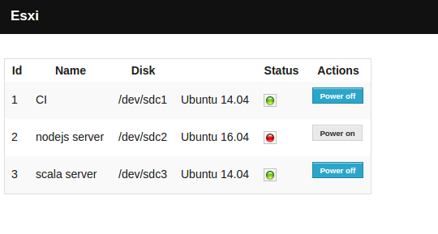

## Description

Web admin for VMWare ESXi hypervisor 5  (no VCenter or VSphere client is required)

Codename: S ESXi MaN (System for ESXi Monitoring And Notification)

Requires SSH access to be enabled on the host and configured.

## SSH setup

In order to get access to ESXI through SSH you need to authorise your private
SSH key (ssh-keygen, authorized_keys)

## Features

* See status of servers (on/off)
* Turn servers on/off
